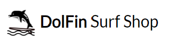
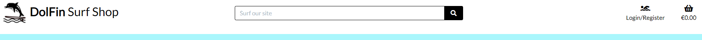

# DolFin Surf Shop

The DolFin Surf Shop is an E-Commerce shopping site. The site sells surf equipment and accessories. It is targeted at experience surfers and shoppers new to the surfing world.

## Multi Screen of the site
Dolfin-Surf Shop - https://

## Design of the site
### Wireframes
When designing the look and feel of the site I looked at 

### Colours

The colours were chosen along with the images to convey a cool breezy beach vibe. (List colours)

The predominant colour is cool blue: #a9f6fc for the background. Font colours is muted grey with black for the heading.

### Typography
The fonts selected were: Lato for simplicity.
### Data Models

## User Stories

### Epic - View and Navigation	
1.	Shopper	View all products 	See all products that are available on the site.
2.	Shopper	View an individual product details	"Look at the product in more detail, get a more detailed description,
product size, colour, weight or dimensions depending on the product."
3.	Shopper	"View commonly purchased product or products
with the product on view"	"See other product or products that were bought along with the 
product that I am currently viewing"
4.	Shopper	View running total of items and total cost in shopping bag	"Make an informed decision on my purchases as I
continue to shop on the site."
### Epic - Registration and User Accounts	
5.	Site User	Allow the site visitor to register on the site	"Have a personal account to be able to view my
profile"
6.	Site User	Easily login or logout	Access my personal account information
7.	Site User	Easily recover my password in case I forget it 	Recover access to my account
8.	Site User	Receive an email confirmation after registering	Verify my account registration was successful
9.	Site User	Have a personalized user profile	View my personal order history and order confirmations.
10.	Site User	Facility to review a product purchased	Inform other shoppers of my views on the product
### Epic - Filter,  Sort and Search	
11.	Shopper	"Functionality to filter on products such as categories
or brands"	Easily identify the product that I wish to view in detail
12.	Shopper	Sort products by price, rating or new stock	Find the best-priced, best rated or newest products
13.	Shopper	Sort for a specific category	"Find the best-priced, best rated newest products
for a specific category"
14.	Shopper	Search for a product by name or description	Find a specific product I'd like to purchase
15.	Shopper	"Easily see what I've searched for and the number of
results"	Quickly decide if the product I want is available on the site.
### Epic - Purchasing and Checkout	
16.	Shopper	"Easily select the size, quantity, colour
or the dimensions of a product"	"Ensure I don't accidentally select the wrong product
quantity, size, colour, dimensions, weight."
17.	Shopper	Easily see if stock is available for product selected	Only purchase a product chosen if stock is on hand.
18.	Shopper	Purchase a gift card for a particular value	"Buy a gift for a friend who can then purchase
products on the site."
	Shopper	Use part of the value of a gift card to purchase a product	"Can have a remaining balance on my gift card
for future use"
19.	Shopper	Use the value of a gift card	Purchase a product using the value of this gift card
20.	Shopper	View items in my bag to be purchased	"Identify the total cost of my purchase and all items  I
will recieve"
21.	Shopper	Adjust the quantity of individual items in my bag	"Easily make changes to my purchases before
checkout"
22.	Shopper	Easily enter my payment information	Put my payment through quickly without any problems
23.	Shopper	View an order confirmation after checkout	Verify that I haven't made any mistakes
24.	Shopper	Receive an email confirmation after checking out	"Keep the confirmation of what I have purchased for 
my records"
25.	Shopper	Receive an email that my order was dispatched	Kept informed of the progress of my order
### Epic - Admin and Shop Management	
26.	Site Owner	Add a product	Add new products to the site
27.	Site Owner	Edit\Update a product	"Change product prices, description, images and 
other product changes"
28.	Site Owner	Delete a product	Remove items that are no longer for sale
29.	Site Owner	Update the quantity available of products	Manage inventory of stock
30.	Site Owner	Ability to make a product obsolete	"Show that a product is no longer available
on the site"
31.	Site Owner	Ability to add a discount to a particular category of products	Offer my customers offers on products 
32.	Site Owner	Ability to dispatch an order	Inform my customers that their purchase is on its way to them
## Features/Functions

## Existing Features

### Navigation Bar
Logo

The Logo links back to the home page.

If the user is not signed in the Sign in and Register links are visible in the navbar. If the user is signed in the Sign In and Register links are replaced by a Sign Out link and thelink is visible:
 Navigation for not signed in user

 Navigation for signed in user

The active page is highlighted for good UX:
 My Recipes page highlighted

The navbar sticks to the top of the page so remains in view for the user to easily navigate around the site

* The navigation bar is located at the top of all pages on the site.
* The options available dynamically change depending on the type of viewer and depending on the specific menu path chosen.
### Registration/Login Forms

### Home button

## Functions

### Future Features 

## Technology
### Language Used

* [Python](https://www.python.org) - Python is an interpreted high-level general-purpose programming language. I used Python to access the data in Google Sheets and run the game.
* [CSS](https://) - Cascading Style Sheets (CSS) is a style sheet language used for describing the presentation of a document written in a markup language such as HTML. 
* [HTML](https://) - The HyperText Markup Language, or HTML is the standard markup language for documents designed to be displayed in a web browser.
* [JavaScript](https://) - JavaScript is a text-based programming language used both on the client-side and server-side that allows you to make web pages interactive.
### Databases 
* SQLite3 - SQLite is a relational database management system which was used as a test database while developing my webite in GitPod
* PostgreS - PostgreS is a relational database management system which is used on my deployed site in Heroku.

### Other Technologies and Libraries

* [Django](https://www.) - Django is a Python-based free and open-source web framework that follows the model–template–views architectural pattern.
* [GitPod](https://gitpod.io) - Gitpod is an online cloud based IDE. I developed and tested my project using Gitpod. I added and commited changes with messages and pushed to GitHub.
* [GitHub](https://github.com) - GitHub is a provider of Internet hosting for software development and version control using Git.
* [Heroku](https://heroku.com) - Heroku is a cloud platform as a service supporting several programming languages. I used Heroku to deploy and run the project.
* [AWS](https://aws.amazon.com) - provides cloud computing platform for images of product sold on the site.
* [Stripe](https://stripe.com) - provides financial services for the site.
* [Google Sheets](https://www.google.com/sheets/about/) - used to plan the data moddels story flow, the story content, story prompts and the next steps for the game. 
* [Diagrams](https://wwww.diagrams.net) - used to create the flowchart for the project.
* [Bootstrap v5.1](https://getbootstrap.com/) - used for the styling and the reposnive design site.
* [Balsamiq](https://balsamiq.com/) - used for creating the wireframes while planning the look of the site. Not all the wireframes are exactly like the end product.
* [Django Secret Key Generator](https://miniwebtool.com/django-secret-key-generator/) - used to generate a django secret key at the begining of the project.
* [XML-Sitemaps](https://www.xml-sitemaps.com/) - used to generate sitemap.xl file for search engine optimisation for the site.
* [Facebook](http://facebook.com) - used to create a facebook page for the site.
* [Mailchimp](https://mailchimp.com) - used for the newsletter.
* [PicResize](https://picresize.com) - used to resize images for better performance when rendering the images.
* [Techsini](https://techsini.com/multi-mockup/) - used for the multi device site mockups

## Testing
### Manual Testing

### Validator Testing

## CSS
[W3C CSS Validator](https://jigsaw.w3.org/css-validator/validator)

## HTML
[Nu Html Checker Validator](https://validator.w3.org/)

## Javascript
[JShint](https://jshint.com/)

## Python
 
I ran the admin.py, forms.py, models.py and urls.py through [PEP8](http://pep8online.com) online checker and all now have no errors.

## Deployment

The application uses Heroku for deployement

### Create the application
1. Create the requirements file the Heroku will use to import the dependencies required for deployment: type pip3 freeze > requirements.txt. 

2. Navigate to the [Heroku](https://heroku.com) website
3. Create an account by entering your email address and a password
4. Activate the account through the authentication email sent to your email account
5. Click the new button and select create a new app from the dropdown menu
6. Enter a name for the application which must be unique, in this case the app name is called views-it.
7. Select a region, in this case Europe
8. Click create app
## Attach the PostgreSQL databae
1. Click on the resources tab on the horizontal menu bar to add a database
2. In the add-ons box search for Postgres
3. Add Heroku Postgres to the project
## Heroku settings
1. From the horizontal menu bar select 'Settings'.
2. Click on Reveal Config Vars,  this gives us our database url, the connection to our database.
3. Make sure you have your secret key added
4. Make sure the AWS settings are added for your media and static files
5. Make sure your Email user and email host pass are added
6. Make sure your Stripe keys are added
6. Take out any temporary environment variables, such as DISABLE_COLLECT_STATIC.

### Deployment
1. In the top menu bar select 'Deploy'.
2. In the 'Deployment method' section select 'Github' and click the connect to Github button to confirm.
3. In the 'search' box enter the Github repository name for the project. Click search and then click connect to link the heroku app with the Github repository. The box will confirm that heroku is connected to the repository which in this case is .
4. Scroll down to select either automatic or manual deployment. For this project automatic deployment was selected. If you wish to select automatic deployment select the button 'Enable Automatic Deploys'. This will rebuild the app every time a change is pushed to Github. If you wish to manually deploy click the button 'Deploy Branch'. The default 'Master' option in the dropdown menu should be selected in both cases.
5. When the app is deployed a message 'Your app was successfully deployed' will be shown. Click 'view' to see the deployed app in the browser. The live deployment of the project can be seen here
6. The app starts automatically and can be restarted by pressing the 'Run Program' button.

## Forking the Repository
If you wish to fork the repository to make changes without affecting the original you can fork the repository

1. Navigate to the  repository
2. Click the 'Fork' button at the top right of the page.
3. A forked copy of the repository will appear in your Repositories page.
## Cloning the Repository
1. On [GitHub](https://github.com) navigate to the main page of the   repository.
2. Above the list of files click the dropdown code menu.
3. Select the https option and copy the link.
4. Open the terminal.
5. Change the current working directory to the desired destination location.
6. Type the git clone command with the copied URL: git clone https://github.com/catrionamcd/.git.
7. Press enter to create the local clone.

Press enter to create the local clone.

## Credits
### Code
https://css-tricks.com/indeterminate-checkboxes/#top-of-site

* Mastering Django by Nigel George
* Code Institute - https://codeinstitute.net/.com (Boutique Ado E-Commerce Site)
* Bootstrap - https://getbootstrap.com/docs
* w3schools - https://www.w3schools.com
* stackoverflow - https://www.stackoverflow.com
* pythontutorials - https://www.pythontutorial.net
* geeksforgeeks - https://www.geekforgeek.org
* python - https://docs.python.org
* OrdinaryCoders - https://www.ordinarycoders.com
* Css Tricks - https://www.csstricks.com

### Media

* [Pexels](https://www.pexels.com) - was used for images for the cards categories on the home page.
* [Pixaby](https://www.pixaby.com) - was used for images for the cards categories on the home page.
* [Wetsuit Outlet](https://www.wetsuitoutlet.ie) - was used for images of the various different products.
* [Billabong](https://www.billabong-store.ie) - was used for images of different colour wetsuits.

