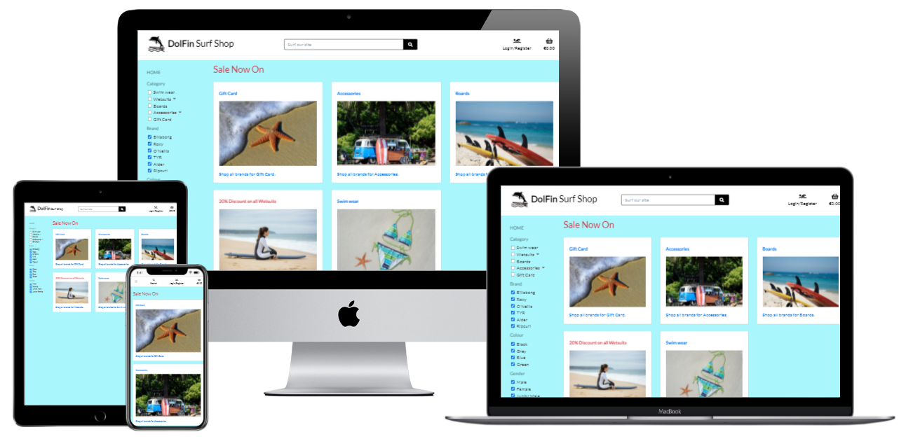
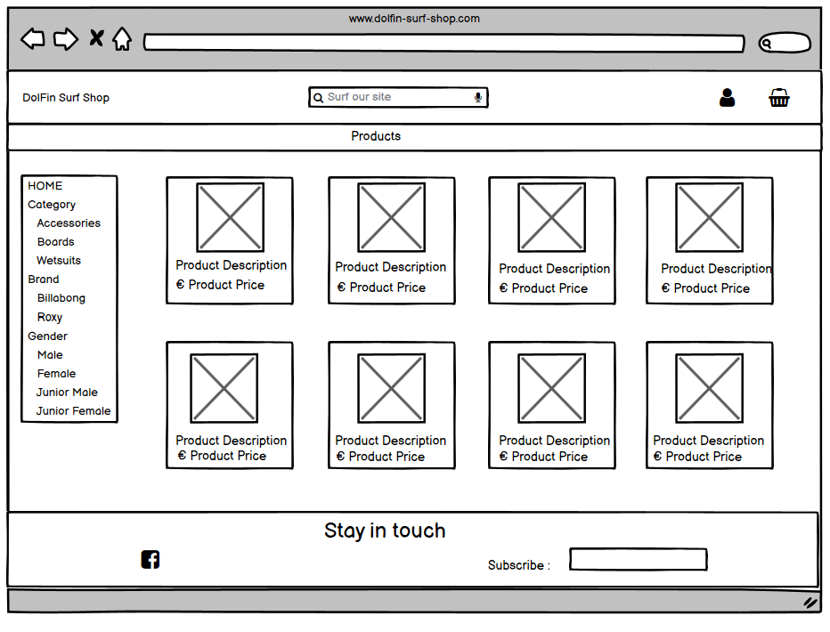
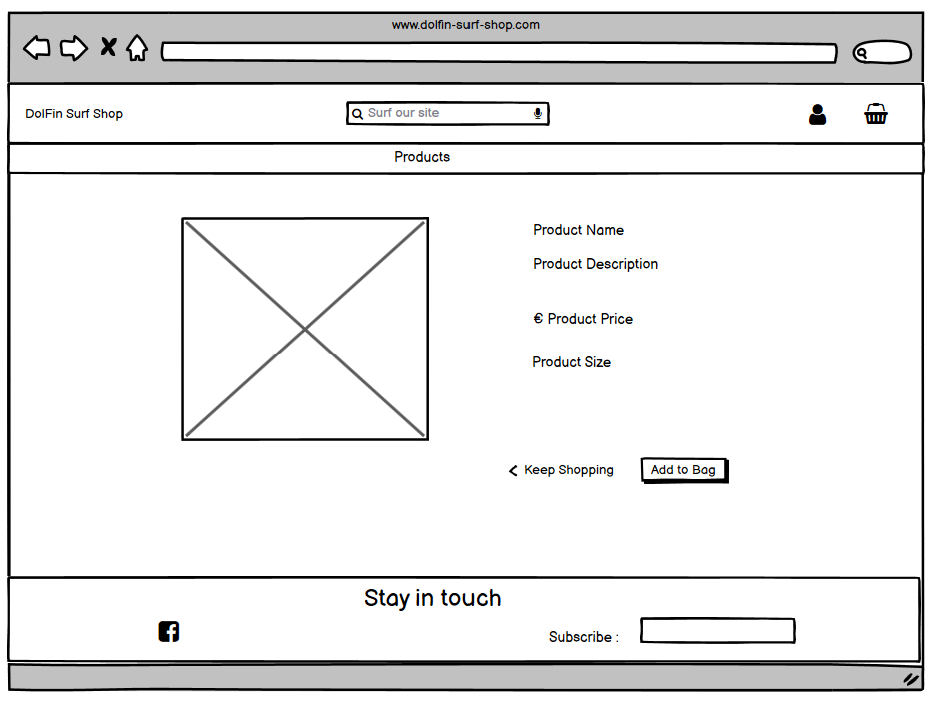

# DolFin Surf Shop

The DolFin Surf Shop is an E-Commerce shopping site. The site sells surf equipment and accessories. It is targeted at experience surfers and shoppers new to the surfing world.

## Multi Device Screens of the site

[DolFin Surf Shop](https://dolfin-surf-shop.herokuapp.com/)

## Design of the site

## Agile
Github was used to plan the project with Agile methodology.

1.	Milestones were used to create Epics.
2.	Issues were used to create User Stories with a custom template. Each user story is clearly described with a title, statement and acceptance criteria.
3.	Labels were used for the acceptance criteria, which were 'Must Have', 'Should Have', 'Could Have'.
4.	Some milestones were also created with an end date to be used as iterations or sprints. 
5.  A Simple Kanban board was used to map the progress of the project.

Each user story was linked to an Epic(Milestone). The user stories were labelled with the acceptance criteria in order to prioritise the work. As work on a user story was begun the story was moved from the 'to do' column on a kanban board to an 'In progress' column. As a user story was moved it was updated with a new milestone that represented an iteration or a sprint.  When work on the story was complete the user story was moved into the 'done' column.
However, I found that as I worked on the project the deadline that I set myself in the sprint or iteration were unrealistic so I abandoned using the milestones for this purpose. It was also difficult given the tight time frame to accurately plan out the amount of work involved in each task or user story in advance. As a result of this some user stories were updated during the course of implementation. Unfortunately, I was unable to complete all of the user stories. These user stories could be incorporated into the future features of the site.

### Wireframes
When designing the look and feel of the site I looked at the Amazon website and numerous live Surf Shop sites.
### Homepage

### Products page

### Product Detail page

### Profile Page

### Checkout Page

### Colours

The colours were chosen along with the images to convey a cool breezy beach vibe. 

The predominant colour is cool blue: #a9f6fc for the background. Font colours is muted grey with black for the heading.

The font Lato as selected for simplicity.

### Data Models

## User Stories
### Epic - Registration and User Accounts	
1.	Site User -	Allow the site visitor to register on the site and have a personal profile. 
2.	Site User -	Easily login or logout of the site.
3.	Site User - Easily recover their password if needs be.
4.	Site User -	Receive an email confirmation after registering	to verify their account registration was successful.
5.	Site User - Have a personalized user profile to view their profile and order history. 
6.	Site User - Facility to review a product purchased to inform other shoppers of my views on the product.

### Epic - View and Navigation	

7.	Shopper - View all products that are available on the site.
8.	Shopper - View an individual product details, get a more detailed description, product size, colour depending on the type of product.
8.	Shopper	- View commonly purchased product or products with the product on view. See other product or products that were bought along with the product that the shopper is currently viewing.
10.	Shopper - View running total of items and total cost in shopping bag. 

### Epic - Filter,  Sort and Search	
11.	Shopper	- Functionality to filter on products such as categories or brands to easily identify the product that I wish to view in detail.
12.	Shopper	- Sort products by price, A-Z product name.	
13.	Shopper	- Sort for a specific category.
14.	Shopper	- Search for a product by name or description within a category chosen from the menu.
15.	Shopper	- Easily see what I've searched for and the number of results.

### Epic - Purchasing and Checkout	
16.	Shopper	- Easily select the quantity and size.
17.	Shopper	- Purchase a gift card for a particular value to buy a gift for a friend.
18.	Shopper	- View items in my bag to be purchased to identify the total cost of their purchase.
19.	Shopper	- Adjust the quantity of individual items in my bag.
20.	Shopper	- Easily enter their payment information. 
21.	Shopper	- View an order confirmation after checkout.
22.	Shopper	- Receive an email confirmation after checking out to have the confirmation of what they have purchased.

### Epic - Admin and Shop Management	
23.	Site Owner - Add a product to the site.
24.	Site Owner - Edit\Update a product, change product prices, description, images etc.
25.	Site Owner - Delete a product that has no orders attached.
26.	Site Owner - Ability to make a product obsolete so that is no longer available for sale on the site.
27.	Site Owner - Ability to add a discount to a particular category of products	to offer sale discount to the customers.

## Features/Functions

## Existing Features

### Navigation Bar
#### Logo

- The Logo links back to the home page.

#### Navigation Bar

- If the user is not signed in the Login/Register links are visible in the navbar. If the user is signed in, the user name is displayed on the navigation bar next to the shopping basket. If the user name is clicked a drop down menu will appear with 'My Profile' and 'Logout' options. 

 - If a superuser or administrator is logged in the dropdown menu that will appear will include an 'Product Management' option along with the 'My Profile' and 'Logout' options.

- The navbar sticks to the top of the page so remains in view for the user to easily navigate around the site.

### Footer

The footer at the bootom of the screen invites the shopper to stay in touch with the DolFin Surf Shop. 
- A Facebook business page was created and the link to Facebook is in the footer of the page along with an invitation to subscribe to a newsletter created using Mailchimp. 

### Registration/Login Forms

The site user can use the site to shop for a product without having to register with the site.
- They can however register on the site by entering in their email address, user name and password. 
- They will receive an email for verification.

- Throughout the site the shopper will get contanst feedback through messages and alerts as shown in the screen above. 

### Homepage - Categories

The homepage on DolFIn Surf Shop will display a image card for each category in the category model. These categories are set up by the superuser or administrator of the site. 
- A shopper may click one of these cards to see all the products availabe on the site within this category.

- All call to action appears at the top of the screen urging the shopper to click for a category and informing the shopper of a delivery deal.
- There is a sale percent field in the category model. This may be updated by the superuser or administrator in the django dashboard. Once there is a value in this field, a 'Sale Now On' banner will show.
- The sale discount will appear on the top of the card category if a sale percent has been entered against this category by the administrator.
- The new sale price for each product within the sale category will be calculated and displayed along with the original price of the product throughout the site.

- A side menu allows the user to also select a category or categories depending on what they have choosen. 
- A shopper may also decide to filter by certain brands.
- A shopper may use the search bar to enter a certain description or name of a product. This makes the site very flexible in searching and filtering for certain products.

### Products Page 

Once the shopper has chosen the selection of products they wish to view the products page will be displayed. 

- The products page has an image of each product. The description and price of the product.
- The shopper may click on any of these products to see a product in more detail.

## Future Features
Use of gift voucher for payment
Dispatch
Product Inventory 

## Bugs
Filter for gender
Rating
## Technology
### Language Used

* [Python](https://www.python.org) - Python is an interpreted high-level general-purpose programming language. I used Python to access the data in Google Sheets and run the game.
* [CSS](https://) - Cascading Style Sheets (CSS) is a style sheet language used for describing the presentation of a document written in a markup language such as HTML. 
* [HTML](https://) - The HyperText Markup Language, or HTML is the standard markup language for documents designed to be displayed in a web browser.
* [JavaScript](https://) - JavaScript is a text-based programming language used both on the client-side and server-side that allows you to make web pages interactive.
### Databases 
* SQLite3 - SQLite is a relational database management system which was used as a test database while developing my webite in GitPod
* PostgreS - PostgreS is a relational database management system which is used on my deployed site in Heroku.

### Other Technologies and Libraries

* [Django](https://www.) - Django is a Python-based free and open-source web framework that follows the model–template–views architectural pattern.
* [GitPod](https://gitpod.io) - Gitpod is an online cloud based IDE. I developed and tested my project using Gitpod. I added and commited changes with messages and pushed to GitHub.
* [GitHub](https://github.com) - GitHub is a provider of Internet hosting for software development and version control using Git.
* [Heroku](https://heroku.com) - Heroku is a cloud platform as a service supporting several programming languages. I used Heroku to deploy and run the project.
* [AWS](https://aws.amazon.com) - provides cloud computing platform for images of product sold on the site.
* [Stripe](https://stripe.com) - provides financial services for the site.
* [Google Sheets](https://www.google.com/sheets/about/) - used to plan the data moddels story flow, the story content, story prompts and the next steps for the game. 
* [Diagrams](https://wwww.diagrams.net) - used to create the flowchart for the project.
* [Bootstrap v5.1](https://getbootstrap.com/) - used for the styling and the reposnive design site.
* [Balsamiq](https://balsamiq.com/) - used for creating the wireframes while planning the look of the site. Not all the wireframes are exactly like the end product.
* [Django Secret Key Generator](https://miniwebtool.com/django-secret-key-generator/) - used to generate a django secret key at the begining of the project.
* [XML-Sitemaps](https://www.xml-sitemaps.com/) - used to generate sitemap.xl file for search engine optimisation for the site.
* [Facebook](http://facebook.com) - used to create a facebook page for the site.
* [Mailchimp](https://mailchimp.com) - used for the newsletter.
* [PicResize](https://picresize.com) - used to resize images for better performance when rendering the images.
* [Techsini](https://techsini.com/multi-mockup/) - used for the multi device site mockups

## Testing
Manual Testing Documentation [here](TEST.md)

### Validator Testing

## CSS
[W3C CSS Validator](https://jigsaw.w3.org/css-validator/validator)

## HTML
[Nu Html Checker Validator](https://validator.w3.org/)

## Javascript
[JShint](https://jshint.com/)

## Python
 
I ran the admin.py, forms.py, models.py and urls.py through [PEP8](http://pep8online.com) online checker and all now have no errors.

## Deployment

The application uses Heroku for deployement

### Create the application
1. Create the requirements file the Heroku will use to import the dependencies required for deployment: type pip3 freeze > requirements.txt. 

2. Navigate to the [Heroku](https://heroku.com) website
3. Create an account by entering your email address and a password
4. Activate the account through the authentication email sent to your email account
5. Click the new button and select create a new app from the dropdown menu
6. Enter a name for the application which must be unique, in this case the app name is called views-it.
7. Select a region, in this case Europe
8. Click create app
## Attach the PostgreSQL databae
1. Click on the resources tab on the horizontal menu bar to add a database
2. In the add-ons box search for Postgres
3. Add Heroku Postgres to the project
## Heroku settings
1. From the horizontal menu bar select 'Settings'.
2. Click on Reveal Config Vars,  this gives us our database url, the connection to our database.
3. Make sure you have your secret key added
4. Make sure the AWS settings are added for your media and static files
5. Make sure your Email user and email host pass are added
6. Make sure your Stripe keys are added
6. Take out any temporary environment variables, such as DISABLE_COLLECT_STATIC.

### Deployment
1. In the top menu bar select 'Deploy'.
2. In the 'Deployment method' section select 'Github' and click the connect to Github button to confirm.
3. In the 'search' box enter the Github repository name for the project. Click search and then click connect to link the heroku app with the Github repository. The box will confirm that heroku is connected to the repository which in this case is .
4. Scroll down to select either automatic or manual deployment. For this project automatic deployment was selected. If you wish to select automatic deployment select the button 'Enable Automatic Deploys'. This will rebuild the app every time a change is pushed to Github. If you wish to manually deploy click the button 'Deploy Branch'. The default 'Master' option in the dropdown menu should be selected in both cases.
5. When the app is deployed a message 'Your app was successfully deployed' will be shown. Click 'view' to see the deployed app in the browser. The live deployment of the project can be seen here
6. The app starts automatically and can be restarted by pressing the 'Run Program' button.

## Forking the Repository
If you wish to fork the repository to make changes without affecting the original you can fork the repository

1. Navigate to the  repository
2. Click the 'Fork' button at the top right of the page.
3. A forked copy of the repository will appear in your Repositories page.
## Cloning the Repository
1. On [GitHub](https://github.com) navigate to the main page of the   repository.
2. Above the list of files click the dropdown code menu.
3. Select the https option and copy the link.
4. Open the terminal.
5. Change the current working directory to the desired destination location.
6. Type the git clone command with the copied URL: git clone https://github.com/catrionamcd/.git.
7. Press enter to create the local clone.

Press enter to create the local clone.

## Credits
### Code
https://css-tricks.com/indeterminate-checkboxes/#top-of-site

* Mastering Django by Nigel George
* Code Institute - https://codeinstitute.net/.com (Boutique Ado E-Commerce Site)
* Bootstrap - https://getbootstrap.com/docs
* w3schools - https://www.w3schools.com
* stackoverflow - https://www.stackoverflow.com
* pythontutorials - https://www.pythontutorial.net
* geeksforgeeks - https://www.geekforgeek.org
* python - https://docs.python.org
* OrdinaryCoders - https://www.ordinarycoders.com
* Css Tricks - https://www.csstricks.com

### Media

* [Pexels](https://www.pexels.com) - was used for images for the cards categories on the home page.
* [Pixaby](https://www.pixaby.com) - was used for images for the cards categories on the home page.
* [Wetsuit Outlet](https://www.wetsuitoutlet.ie) - was used for images of the various different products.
* [Billabong](https://www.billabong-store.ie) - was used for images of different colour wetsuits.

