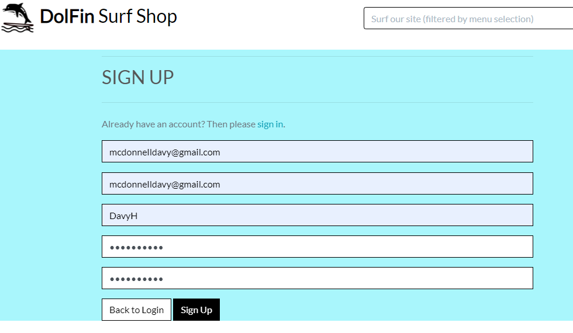

# Manual Testing
Manual testing throughout the site. Steps and results are as follows.

## User Stories
### Epic - Registration and User Accounts
##### Testing Steps:

1. To register on the site and have a personal profile.

2. To easily login or logout of the site.
3. Receive an email when I have registered on the site.
4. If incorrect username or password used, error message displayed.  

Pass/Fail : **Pass**

### Epic - View and Navigation	

Navigation - check that all navigation links work as expected
#### Testing Steps:

1. Without logging in click on the links in the navbar
2. Enter search in search criteria
4. Click on Card Category to see all products for that category.

Pass/Fail : **Pass**

7.	Shopper - View all products that are available on the site.
8.	Shopper - View an individual product details, get a more detailed description, product size, colour depending on the type of product.
8.	Shopper	- View commonly purchased product or products with the product on view. See other product or products that were bought along with the product thatthe shopper is currently viewing.
10.	Shopper - View running total of items and total cost in shopping bag. 

### Epic - Filter,  Sort and Search	
11.	Shopper	- Functionality to filter on products such as categories or brands to easily identify the product that I wish to view in detail.
12.	Shopper	- Sort products by price, A-Z product name.	
13.	Shopper	- Sort for a specific category.
14.	Shopper	- Search for a product by name or description within a category chosen from the menu.
15.	Shopper	- Easily see what I've searched for and the number of results.

### Epic - Purchasing and Checkout	
16.	Shopper	- Easily select the quantity and size.
17.	Shopper	- Purchase a gift card for a particular value to buy a gift for a friend.
18.	Shopper	- View items in my bag to be purchased to identify the total cost of their purchase.
19.	Shopper	- Adjust the quantity of individual items in my bag.
20.	Shopper	- Easily enter my payment information. 
21.	Shopper	- View an order confirmation after checkout.
22.	Shopper	- Receive an email confirmation after checking out to have the confirmation of what they have purchased.

### Epic - Admin and Shop Management	
23.	Site Owner - Add a product to the site.
24.	Site Owner - Edit\Update a product, change product prices, description, images etc.
25.	Site Owner - Delete a product that has no orders attached.
26.	Site Owner - Ability to make a product obsolete so that is no longer available for sale on the site.
27.	Site Owner - Ability to add a discount to a particular category of products	to offer sale discount to the customers.

# 404/500 Custom Error Screens

If a 404 error occurs a custom Dolfin Surf Shop screen will be displayed with the link to direct the sjopper back to the site.

Similarly when a 500 error occurs:

# Code Validation

## CSS Validation

 

## HTML Validation

## Python

**Bag**
*Apps.py*

**Bag**
*Context.py*

**Bag**
*Urls.py*

**Bag**
*Views.py*

**Bag/templatetags**
*bag_tools.py*

**Checkout**
*Admin.py*

**Checkout**
*Apps.py*

**Checkout**
*Forms.py*

**Checkout**
*Models.py*

**Checkout**
*Views.py*

**Checkout**
*Webhooks_Handler.py*

**Checkout**
*Webhook.py*

**Home**
*Apps.py*

**Home**
*Urls.py*

**Home**
*Views.py*

**Products**
*Admin.py*

**Products**
*Apps.py*

**Products**
*Forms.py*

**Products**
*Models.py*

**Products**
*Urls.py*

**Products**
*Views.py*

**Products**
*Widgets.py*

**Profiles**
*Admin.py*

**Profiles**
*Apps.py*

**Profiles**
*Forms.py*

**Profiles**
*Models.py*

**Prodfiles**
*Urls.py*

**Profiles**
*Views.py*

**Settings.py**

This refers to the following lines which are built in to Django settings. This is a known Django error and it is acceptable not to force a line break in these cases.

## Javascript

