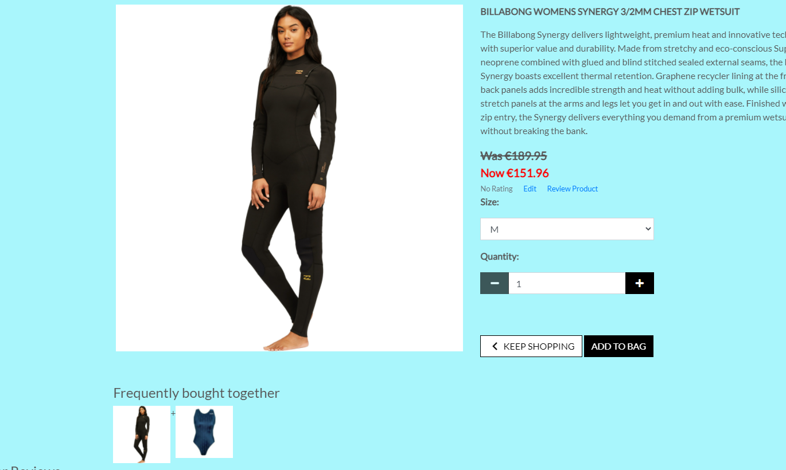

# Manual Testing
Manual testing throughout the site. Steps and results are as follows.

## User Stories
### Epic - Registration and User Accounts

- User presented with homepage with cards for the different categories of product on sale on the site. They also should be presented with a side bar menu.

#### Testing Steps: 
- Click on Login/Register to set up a new user with email, name and password.

- Make sure the password is valid.

- Make sure the user receives an email for verification.

- Ensure that the user can then login and out easily.

- If incorrect username or password used, error message displayed.  

- Once the user is loggged in the user name should appear on the top right hand side of the navigation bar.

Pass/Fail : **Pass**

### Epic - View and Navigation	

Navigation - check that all navigation links work as expected.
#### Testing Steps:

- Without logging in click on the links in the navbar.
- Enter nothing in search criteria to get an error message.

- Click on Card Category to see all products for that category even if the shopper is not logged in.

Pass/Fail : **Pass**

- Click on Category and/or sub-category in the side bar to filter products even more.

- Click on a product image to view an individual product details, get a more detailed description, product size, colour depending on the type of product.

-  View commonly purchased product with the product on view. See other product or products that were bought along the product on view.

- View customer reviews on the product
- Click on Home or Company logo to return to homepage.

Pass/Fail : **Pass**

### Epic - Filter,  Sort and Search	
- Enter different filters on products such as categories or brands.

- Sort products by price, A-Z product name.

- Search for a product by name or description within a category chosen from the menu.

- Easily see what I've searched for and the number of results.

Pass/Fail : **Pass**

### Epic - Purchasing and Checkout	
- Easily select the quantity and size.
- Change size and/or quantity if needed.
- Add the product on view to the shopping bag.

- Keep shopping for more products by clicking the 'keep shopping tab'.

- Purchase a gift card for a particular value

- View items in my bag to be purchased to identify the total cost of their purchase.
- Adjust the quantity of individual items in my bag.
- View running total of items and total cost in shopping bag.
- Once happy with the order go to secure checkout.
- Enter user details in checkout screen.

- Easily enter my payment information. 

- If incorrect detial are entered display an error message.

- View an order confirmation after checkout.

- Receive an email confirmation after checking out to have the confirmation of what they have purchased.
- Order details are processed through Stripe 

- The order history can be seen for this users profile.

- Check adding reviews to a product.

- Test editing and deleting a review.

Pass/Fail : **Pass**

### Epic - Admin and Shop Management	
- Add a product to the site.
- Edit\Update a product, change product prices, description, images etc.

- Delete a product that has no orders attached.

- Ability to make a product obsolete so that is no longer available for sale on the site.
- Ability to add a discount to a particular category of productso offer sale discount to the customers.

Pass/Fail : **Pass**

# 404/500 Custom Error Screens

If a 404 error occurs a custom Dolfin Surf Shop screen will be displayed with the link to direct the shopper back to the site.

Similarly when a 500 error occurs:

# Code Validation

## CSS Validation

 

## HTML Validation

## Python

- Bag/Apps.py

- Bag/Context.py

- Bag/Urls.py

- Bag/Views.py

- Bag/templatetags/bag_tools.py

- checkout/Admin.py

- Checkout/Apps.py

- Checkout/Forms.py

- Checkout/Models.py

- Checkout/Views.py

- Checkout/Webhooks_Handler.py

- Checkout/Webhook.py

- Home/Apps.py

- Home/Urls.py

- Home/Views.py

- Products/Admin.py

- Products/Apps.py

- Products/Forms.py

- Products/Models.py

- Products/Urls.py

- Products/Views.py

- Products/Widgets.py

- Profiles/Apps.py

- Profiles/Forms.py

- Profiles/Models.py

- Prodfiles/Urls.py

- Profiles/Views.py

- Settings.py

This refers to the following lines which are built in to Django settings. This is a known Django error and it is acceptable not to force a line break in these cases.

## Javascript

- checkout/static/js/stripe_element.js

- main.html- embedded js

